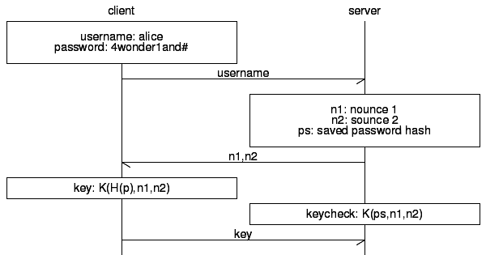
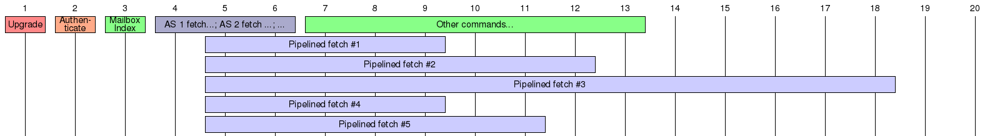

% Internet Mail and Messaging Protocl
% C. Vagnetoft (NoccyLabs.info)
% October 2013

\newpage

# Abstract

The protocols that power Internet mail today are ancient, devised back in the
days long before security was a serious issue they lack in a number of aspects,
mainly transport encryption and digital signing/encryption which have been added
later as an afterthought.

This document proposes a new standard for sending and receiving e-mail on the
Internet; IMMP - Internet Mail and Messaging Protocol.

Please **do note** that despite it's name, this protocol does not intend to replace XMPP as a messaging protocol.

This draft is maintained by NoccyLabs on GitHub: 

      http://github.com/noccylabs/immp-spec/

\newpage 

# About this draft

## Conventions

 * The term *e-mail* is used throughout this document to reference the implementation specified in this draft unless otherwise specified.

> ***CV*** Maybe it would be appropriate to use *e-mail* for the old-school mail, and *i-mail* for "internet mail"? This would also indicate the paradigm change introduced by this prodocol.

 * In examples, `S:` is used to indicate a response from the server while `C:` indicates data sent by the client.

## Terminology

 * *mailbox* is a storage location for folders and messages.
 * *account* is a primary mailbox associated with login credentials.
 * *message* is one or more pieces of *data* with at least one *content* part.
 * *data* is a message chunk, such as the content in HTML or MarkDown format, an image or an attachment.

## Design Considerations

The following points are key to the design of the protocol:

 * All transport of messages or user information requires transport encryption.
 * The protocol must be plaintext and easy to follow.
 * The protocol must fill the role of the three main protocols in use today,
   namely SMTP for transport, and POP3/IMAP for retrieval/storage.
 * The protocol must not be immediately backward compatible with the previously
   mentioned protocols, for the sole reason of not compromising its integrity by
   allowing one link of the chain to fallback on insecure transports.
 * The protocol should provide a transport for high-importance push-events from
   previously approved source.
 * The protocol should authenticate originating domains, while allowing the sender
   to remain anonymous.

\newpage

# Features

## IMIDs instead of E-Mail Addresses

IMIDs are much more flexible, and can use a uniform URI system to reference mailboxes, mailing lists, published nodes etc.

## Central storage (IMAP4)

### ...and Shared storage

Several users belonging to a group could share a mailbox, f.ex. 
`helpdesk@domain.com`, with each of them having their own mailboxes
as `helpdesk/alice@domain.com` and `helpdesk/bob@domain.com`.

### ...or Temporary storage (POP3)

For automated services, the ability to download messages in a fashion
similar to POP3 this would be beneficial for server storage space as
well as bandwidth and management costs.

### ...or Push messages

Sometimes, the purpose of a message is just to request a confirmation, or to
notify the success or failure of a process. In those cases it is reasonable
to bypass the inbox, and for that the message can be sent as a push message.

#### Scenario 1. E-mail configuration

 1. Alice goes to Website.com, and registers a new account.
 2. In order to validate Alice's e-mail address Website.com sends a
    push-notification to Alice's address containing a configuration link.
 3. Alice receives this notification, and can click "Confirm" in the desktop
    notification she is presented with.

#### Scenario 2. Notifications

Servers, SANs, NASes, and other network devices often report conditions and
events by mail. With IMMP these could be handled separately from other business
correspondence.

## Message Delivery (SMTP)

The same port and protocol that is used to read and manage the mailboxes is also used to deliver messages to mailboxes. This provides a huge advantage in confiugration and management.

Additionally, filtering can be implemented as is currently for SMTP, implementing heuristic or other analysis of messages.

## Publish-Subscribe Events (XMPP)

In this concept borrowed from XMPP, messages and push-notifications can be
subscribed to in a fashion managed by the user. The user can then manage his or
her subscriptions as desired, and easily unsubscribe from undesired mailing
lists.

For this reason, a subscription SHOULD BE able to be initated via a URI handler
such as this one:

      immp://newsletter/updates@website.com?subscribe

Each subscription is assigned a unique identifier, and metadata is fetched as
the subscription is created. This allows the user to easily get an overview of
any current subscriptions.

| UUID   | IMID^[Internet Messaging ID] | Node                   | Title                    |
|:-------|:-----------------------------|:-----------------------|:-------------------------|
| ...    | newsletter@website.com       | newsletter/updates     | Updates from Website.com |

### Publishing Events

When a website wishes to reach out to its subscribers it turns the stake. The
message is pushed to each of the subscribers, which confirm its origin and the
presence of the subcription, thus defeating a bit of unsolicited e-mailing by
flagging the real ones.

~~~~
   C:  PUSH TO noccy@noccylabs.info FROM newsletter@website.com/updates +IMPORTANT 
   S:  
~~~~

## Intrinsic Security

Encryption is an integral part of the protocol, as it does not under any
circumstances allow any information exchange to take place before the session
has been secured.

The session begins by the server indicating what methods it can use to upgrade
the connections.

The proposed methods are:

 * `SSLv3`
 * `TLS`

The key fingerprints should be compared to previously seen ones when upgrading
the connection. Messages that are flagged as `+SECURE` MUST NOT be delivered
over a connection where the fingerprint failed. The administrator always be
notified, and the server should retry delivery in 5 minutes and then according
to a defined schedule.

### No Plain-text passwords

Passwords MUST BE saved using the key derivation algorithm specified in
this draft. The output from the KDA is the effective password for the
account.

Upon the client requesting authentication using a shared secret (the generated 
password) the server sends over two nounces, that are used by both the client
and the server to calculate a key. The client sends its calculated key to the
server, and the server compares the key. If the keys match, the user is logged
in.

This way plain-text passwords are never transferred in the clear, and are
only used for key derivation.

> ***CV:*** This lacks in several aspects; first of all the passwords can be
> compromised and used to authenticate as the user. Better would be to use
> one of the nounce values as the salt, and have the user salt his copy as
> ordered by the server. Another option would be to fall back on a simpler
> scheme that allows for server-side hashed passwords.

For **IMMP 1.0** H and K are defined as:

 * *H(p)* is the key derivation algorithm.
 * *K(h,n1,n2)* is the key generation algorithm that takes the password
   hash *h*, concatenated with *n1* and *n2* and calculates the sha1 sum
   of the full string.

## Pipelining On-Demand

Any command can be pipelined, thus allowing for example several attachments
to be added at the same time issuing `AS xxxx DATA ...` rather than just
`DATA ...`.

By chaining commands using semicolons, it would be possible to initiate several downloads at once, each in its own pipeline.

## Commands

Commands come in the form of one or more keywords, followed by zero or more
parameters or switches:

~~~~
  AUTHENTICATE COOKIE cacabeefcacabad0 otherdomain.com
        |                     |               |
  AUTHENTICATE SECRET noccy@noccylabs.info    |
        |                     |---------------'
        '-----.               | 
           Keywords        Parameters    Switches
              |               |              '---------------------.
              |               |                                    |
  AS beef MBOX FETCH /inbox#9507ce26-d34e-41cb-9f14-4eeff943e25e +JSON -READ
        |
   Pipeline ID
~~~~

 * Keywords are written in `CAPITAL LETTERS` in this document but the parsers
   SHOULD NOT be case sensitive when parsing keywords.
 * Words in lower case should be replaced with the appropriate values.
 * Quoted strings should be used verbatim.
 * Parameters only have to be quoted if they contain spaces.
 * Switches enable or disable a certain behavior of the command.
 * Pipelines can be created by prefixing the keyword `AS` followed by the
   desired pipeline ID to use. All replies for this pipeline will have this ID
   followed by a colon prefixed to their status codes.

## Responses

~~~~
  [ pipeline ": "] statuscode ["-"] " " message "\n"
       |                |       |           |      '-- Ends with newline
       |                |       |           '-- The message
       |                |       '-------- Dash for continuation
       |                '------ The numeric status code
       '------ The pipeline ID as defined with "AS"
~~~~

## Push Messages

Push-messages place a central role in IMMP. E-mail has become the current provider of web-centered push-notifications, albeit its shortcomings and quirks. IMMP aims to fix this problem by allowing the transport of both messages and notifications.

Notifications here are simplified messages, with the body reduced to a single data block.

## Blacklisting: In Case Of Spam

\newpage

# The protocol

## IMIDs

IMID stands for Internet Mail (or Messaging) ID. Unlike e-mail addresses, IMIDs
can have subnodes. For example:

~~~~
  domain.com
   |--helpdesk@domain.com
   |   |--helpdesk/alice@domain.com
   |   '--helpdesk/bob@domain.com
   '--admin@domain.com
~~~~

In a similar fashion, you can direct messages to folders by appending a plus-sign
followed by an existing folder name, for example:

~~~~
  alice@domain.com
   |--INBOX
   |   |--Receipts
   |   '--Mailinglists
   |--DRAFTS
   |--SENT
   '--JUNK
~~~~

Alice could in this case get her mailing list subscriptions (the involuntary kind)
directed to the `:inbox/Mailinglists` folder by providing her IMID as
`alice+mailinglists@domain.com`. Servers implementing IMMP MUST respect the folder
redirections, and websites supporting IMMP MUST respect them for any communication
but ignore them for any (public) display. Default folders such as INBOX, DRAFTS,
SENT and JUNK should be excluded from filtering.

Messages are references as `user@host/mailbox#messageid`:

~~~~
  alice@domain.com
  |--INBOX
  :   |-- 619b982c-f9b4-4263-bbc7-755afc7710dd
      |-- 716e9a9e-7a48-4fd0-aa80-a1ac52f13cb2
      :
~~~~

In this example the full URI to the first message would be:

      alice@domain.com/INBOX#619b982c-f9b4-4263-bbc7-755afc7710dd

## Using JSON

JSON (JavaScript Object Notation) is a portable and well proven format for encapsulating structured data. Therefore it makes sense to include it in the protocol to make it easier for the clients to parse the data.

To enable JSON output, provide `+JSON` to a function that supports it. For example:

~~~~
  C:  FETCH alice@domain.com/INBOX#74d273d2-15c6-4420-81c1-1ae7edbcf3fe +JSON +PRETTY
  S:  ??? Message follows (Pretty Print)
  S:  {
  S:    'envelope': {
  S:      'from': 'bob@domain.com',
  S:      'to': 'alice@domain.com',
  S:      'received': {
  S:      } 
  S:    },
  S:    'parts': [
  S:      { 'id':'body', 'class':'content', 'type':'text/html', 'length':1394, 'encoding':'base64', 'data':'...' },
  S:      { 'id':'img_logo', 'type':'image/png', 'length':16354, 'encoding':'base64', 'data':'...' }
  S:    ]
  S:  }
  S:  ...
~~~~

## The Protocol States

The protocol is divided up into a number of phases, or states, each allowing a specific
subset of the supported commands.

1. **Unencrypted** - In this phase only commands to upgrade the transport are allowed. No messages can be delivered, and no authentication can be made.
2. **Unauthenticated** - In this phase only authentication commands (local users as well as remote cookies) or push-events are allowed.
3. **Local Authenticated** - can access mailboxes and send mail.
4. **Remotely Authenticated** - Can deliver mail to local mailboxes.

## Message Transport

### Over TCP

Over TCP it is suggested that IMMP use a port such as `1025`, hinting at the old SMTP port number.

The TCP transport is the primary focus of this draft.

### Over XMPP

This is a thrilling new use of XMPP as the middleman in delivering messages between two IMMP servers. XMPP already has a number of advantages over IMMP in this aspect, such as:

 * **Persistent Connections** - Connections between XMPP-servers are in many cases persistent, especially when between a bigger XMPP service provider and another server. This could be great for IMMP as it would remove the overhead of establishing a connection and upgrading a session. The problem would be if a server upstream would lack encryption. This can however be solved by armoring the message with encryption before sending over an XMPP transport.
 * **Encryption** - Encryption is well defined and readily used to secure XMPP connections already. This adds to the transport security.

\newpage

# Commands and Responses

## Commands

Commands come in the form of one or more keywords, followed by zero or more
parameters or switches:

~~~~
  AUTHENTICATE COOKIE cacabeefcacabad0 otherdomain.com
        |                     |               |
  AUTHENTICATE SECRET noccy@noccylabs.info    |
        |                     |---------------'
        '-----.               | 
           Keywords        Parameters    Switches
              |               |              '---------------------.
              |               |                                    |
  AS beef MBOX FETCH /inbox#9507ce26-d34e-41cb-9f14-4eeff943e25e +JSON -READ
        |
   Pipeline ID
~~~~

 * Keywords are written in `CAPITAL LETTERS` in this document but the parsers
   SHOULD NOT be case sensitive when parsing keywords.
 * Words in lower case should be replaced with the appropriate values.
 * Quoted strings should be used verbatim.
 * Parameters only have to be quoted if they contain spaces.
 * Switches enable or disable a certain behavior of the command.
 * Pipelines can be created by prefixing the keyword `AS` followed by the
   desired pipeline ID to use. All replies for this pipeline will have this ID
   followed by a colon prefixed to their status codes.

## Responses

~~~~
  [ pipeline ": "] statuscode ["-"] " " message "\n"
       |                |       |           |      '-- Ends with newline
       |                |       |           '-- The message
       |                |       '-------- Dash for continuation
       |                '------ The numeric status code
       '------ The pipeline ID as defined with "AS"
~~~~

## Examples

### Upgrading a connection

~~~~
 S:  100- IMMP/1.0 Server at noccylabs.info.
 S:  100- Please upgrade the connection to one of the following:
 S:  100    TLS2 TLS3 
 S:  101 p=IMMP v=1.0 d=noccylabs.info
 C:  UPGRADE TLS3
 S:  204 Upgrading to TLS3.
           //
       Handshake
           //
     Encrypted Transport
~~~~

### Authentication

The authentication in IMMP is very different from previously implemented
algorithms in existing mail protocols. In IMMP both servers and clients must
authenticate. However, the servers authenticate by providing a cookie, thus
providing verification of the origin domain.

~~~~
 C:  AUTH COOKIE c2a9ff172404b21391cbaffbd9 mydomain.com
 S:  301 Cookie authentication request initiated.
 S:  210 Authentication accepted for mailer-daemon@mydomain.com
~~~~

And authentication with a shared secret:

~~~~
 C:  AUTH SECRET noccy@noccylabs.info "Desktop Computer (Mail Client)"
 S:  302 Shared secret authentication request intiated.
 S:  303 n1=24c17bb6-11ef-4cfa-8c5c-440ceadc8431 n2=1381978910
 C:  AUTH RESPONSE 8843d7f92416211de9ebb963ff4ce28125932878
 S:  210 Authenication accepted for noccy@noccylabs.info
~~~~

### Reading Mail

~~~~
 C:  MBOX CHECK /inbox::* +RECURSIVE
 S:  240- /inbox::* u=24 t=1194
 S:  240- /inbox/lists::* u=9 t=502
 S:  240 /inbox/receipts::* u=1 t=105
 C:  AS f9ca MBOX INDEX /inbox::unread +JSON
 C:  AS ab34 MBOX INDEX /inbox/lists::unread +JSON
 ..
~~~~

> *Here pipelined transactions begin, we will follow the `f9ca` pipeline*

~~~~
 S:  f9ca: 250- { "_id":"mydomain_com.4933a1ff", "from":"bob@mydomain.com", ... }
 S:  f9ca: 250 
~~~~

\newpage

# Supported Commands

The commands are designed to be obvious and easily readable.

 * `AUTH COOKIE` - Authenticate the sender with a cookie
 * `AUTH SECRET` - Authenticate a user with a shared secret
 * `DATA` - Begins a data block transfer, for what is comparable to a MIME part of a multipart message.
 * `DELIVER TO` - Deliver a message to a IMID
 * `DONE` - Sends the message initiated with `DELIVER TO` and composed with `DATA`.
 * `MBOX CHECK` - Check the status of a mailbox
 * `MBOX FETCH` - Retrieve the contents of a mailbox, or a single message
 * `MBOX INDEX` - Retrieve the index of a mailbox
 * `PUSH` - Deliver a push-notification to an IMID
 * `PUBLISH` - Publish to a node or create a new published node
 * `SUBSCRIBE` - Subscribe to a published node or list the current subscriptions
 * `SET` - Set a configuration value for the session
 * `SET GLOBAL` - Set a configuration value for the account
 * `UNSUBSCRIBE` - Unsubscribe to a published node

## AUTH command

~~~~
    AUTH COOKIE <cookie> <issuer>
    AUTH SECRET <account> [<devicename>]
~~~~

Cookie authentication allows for the mailer daemon to authenticate the remote host. This authentication method is only available for domains. Users have to use Shared Secret authentication.

The purpose of Cookie authentication is not to authenticate the sender per se, but rather to authenticate the sending domain in order to be sure that the sending domain is who it says it is.

### AUTH COOKIE command

1. `alice@a.com` sends a message to `bob@b.com`.
2. `a.com` connects to `b.com` and generates a cookie which it sends over with the domain name.
3. `b.com` connects back to `a.com' and verifies the cookie.
4. `a.com` authenticates the sending agent (note: not necessarily the sending user)

### AUTH SECRET command

## DATA command

Transfers a data block from the client to the server.

**Syntax:**

~~~~
    DATA [NAME name] [TYPE mimetype] [LENGTH size] [+BASE64] [+CONTENT]
~~~~

**Parameters:**

 * *name* - The name of the data block, f.ex. "image.jpg".
 * *mimetype* - The mimetype of the data block, f.ex. "image/jpeg".
 * `LENGTH` defines the length of the content if present.
 * `+BASE64` indicates that the data is base64-encoded.
 * `+CONTENT` indicates that this is the content data block of the message.

## DELIVER command

Deliver a message to a mailbox.

**Syntax:**

~~~~
    DELIVER TO account [+/-IMPORTANT] [+MULTIPART]
~~~~

**Parameters:**

 * *account* - The account to which to deliver. It does not have to be on the
   local system.
 * `+IMPORTANT` indicates high priority, `-IMPORTANT` indicates low priority.
   Not specifying either indicates normal priority
 * `+MULTIPART` indicates a multipart message.

**Notes:**

Upon receiving this command the server will aounce it being ready to receive the
message, or indicate an error if the message can not be delivered. The client
should then go on and send the message as a data block:

~~~~
    C:  DELIVER TO noccy+analytics@noccylabs.info +IMPORTANT +MULTIPART
    S:  270 Ok, ready to deliver. Give me your DATA.
    C:  DATA logo.jpg TYPE image/jpg +BASE64
    S:  271 logo.jpg Saving part
         ::
        Client sends base64-encoded data, ends it with two blank lines.
         ::
    S:  272 logo.jpg Part saved
    C:  DATA index.html TYPE text/html LENGTH 1742 +CONTENT
    S:  271 index.html Saving content part
         ::
    S:  272 index.html Part saved
    C:  DONE
    S:  
~~~~

## DONE command

Indicates that the client is done sending data for the delivery

## MBOX command

### MBOX CHECK command

### MBOX FETCH command

### MBOX INDEX command

## PUSH command

## PUBLISH command

## SUBSCRIBE command

Subscribe to a publisher, allowing the publisher to `PUSH` notifications.
To unsubscribe use the `UNSUBSCRIBE` command. 

**Syntax:**

~~~~
    SUBSCRIBE TO feed@domain
    SUBSCRIBE LIST
~~~~

**Example:**

~~~~
    C:  SUBSCRIBE TO noccylabs/immp-spec@github.com
    S:  380 Subscribing to publisher
    S:  280 Subscribed to: Notifications for noccylabs/immp-spec
    C:  SUBSCRIBE LIST
    S:  281 33af50bc-4841-4426-b27f-793186b52171 noccylabs/immp-spec
    S:  282 1 subscriptions.
~~~~

## SET command

### SET GLOBAL command

## UNSUBSCRIBE command

Removes a subscription

\newpage

# List of Status Codes

 * `1xx` is informative
 * `2xx` is success messages
 * `3xx` is progress updates pending a `2xx` or `4xx`
 * `4xx` is error messages
 * `7xx` is server or protocol error messages

## 1xx codes

 * `100` Logon info text
 * `101` Server info: p=**protocol** v=**version** d=**domain**

## 2xx codes

 * `204` Upgrading transport with encryption
 * `210` Authentication accepted
 * `240` Mailbox status: u=**unread**, t=**total**
 * `250` Message download in JSON format
 * `251` Message download in MIME Multipart format
 * `270` Awaiting DATA
 * `271` Awaiting content for part
 * `272` Part saved
 * `280` Subscription successful
 * `281` Subscription list item (uuid and info)
 * `282` End of subscription list

## 3xx codes

 * `301` Cookie authentiation initiated
 * `302` Shared secret authentication request initiated
 * `303` Shared secret nounces: n1=**nounce1** n2=**nounce2**
 * `380` Trying to subscribe

